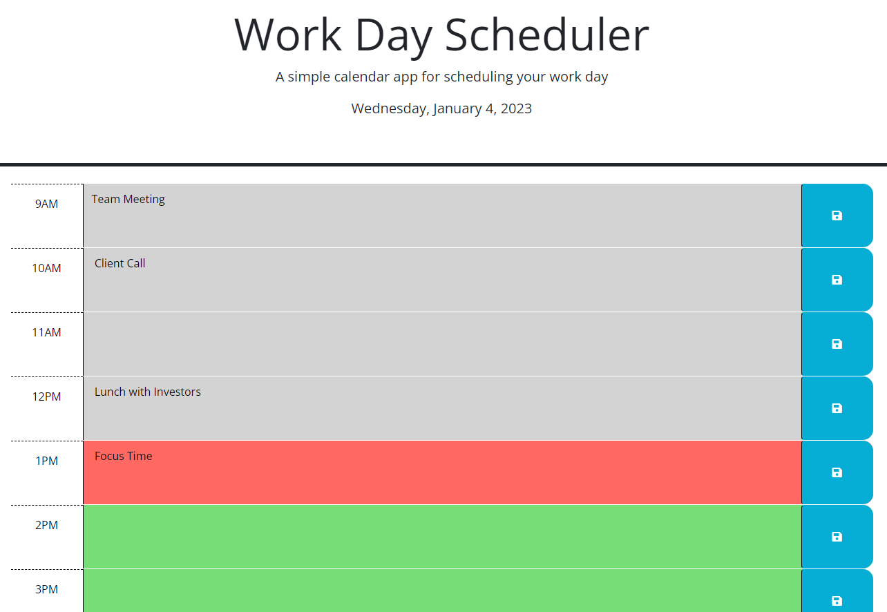

# Work Day Scheduler

## Description

I created a simple calendar application or daily planner that allows a user to save events for each hour of the day. This app runs in the browser and features dynamically updated HTML and CSS powered by jQuery. It uses the [Day.js](https://day.js.org/en/) library to work with the current date and time.

## Mock-Up

The following shows the layout of the application at the end of the work day so all timeslots have passed and are, therefore, colored gray:

## Link
